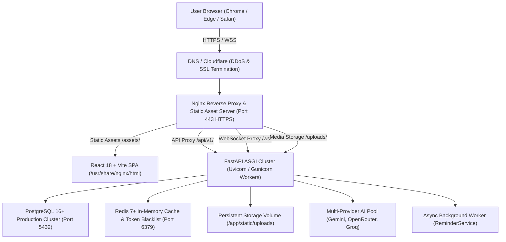

# SMART HIRE AI — REAL PRODUCTION DEPLOYMENT CHECKLIST & SPECIFICATION

**Document Version:** 1.0.0  
**Target Platform:** Production Cloud (Docker Swarm / Kubernetes / AWS ECS / Linux VPS)  
**Security Level:** Enterprise Grade  

---

## 1. Production Architecture Overview



* **Frontend:** React 18, TypeScript, Vite, TailwindCSS (compiled into optimized static bundle served by Nginx).
* **Backend:** Python 3.11, FastAPI, Uvicorn/Gunicorn ASGI server with asynchronous connection pooling.
* **Database:** PostgreSQL 16+ with ACID guarantees, foreign keys, and connection pooling (`pool_size=20`, `max_overflow=10`).
* **Cache:** Redis 7+ for JWT token blacklisting and rate-limit tracking.
* **Storage:** Dedicated persistent volume mount (`/app/static/uploads`) ensuring recordings and resumes survive container restarts.
* **AI Providers:** Tri-tier automatic circuit breaker (Google Gemini, OpenRouter LLaMA-3.3, Groq Whisper/LLaMA).

---

## 2. Production Environment Variables

Never commit `.env` or hardcode credentials. Deploy using environment secrets injection:

| Variable | Requirement | Description / Source |
| :--- | :--- | :--- |
| `ENVIRONMENT` | **Required** | Must be set to `production`. |
| `SECRET_KEY` | **Required** | 64+ char cryptographic key (`openssl rand -hex 32`). |
| `ALGORITHM` | **Required** | `HS256` |
| `USE_SQLITE` | **Required** | Must be `false`. |
| `POSTGRES_SERVER` | **Required** | Production PostgreSQL hostname/IP. |
| `POSTGRES_PORT` | **Required** | `5432` |
| `POSTGRES_USER` | **Required** | Production database user. |
| `POSTGRES_PASSWORD` | **Required** | High-entropy production password. |
| `POSTGRES_DB` | **Required** | `smarthire_db` |
| `REDIS_HOST` | **Required** | Redis hostname. |
| `REDIS_PORT` | **Required** | `6379` |
| `FRONTEND_URL` | **Required** | Production domain (e.g. `https://smarthire.ai`). |
| `CORS_ORIGINS` | **Required** | Allowed origins comma-separated. No wildcards. |
| `GEMINI_API_KEY_1..4` | **Required** | Google Cloud Console Gemini API Keys. |
| `OPENROUTER_API_KEY_1..2` | **Required** | OpenRouter production API Keys. |
| `GROQ_API_KEY_1..2` | **Required** | Groq production API Keys for Whisper and failover. |
| `GOOGLE_CLIENT_ID` | Optional | Google OAuth 2.0 Web Client ID. |
| `GOOGLE_CLIENT_SECRET` | Optional | Google OAuth 2.0 Secret. |
| `SMTP_HOST` | **Required** | Production mail server (e.g. SendGrid, SES, Gmail). |
| `SMTP_PORT` | **Required** | `587` (STARTTLS) or `465` (SSL). |
| `SMTP_USER` | **Required** | Mail server username. |
| `SMTP_PASSWORD` | **Required** | Mail server app password/secret. |
| `SMTP_FROM_EMAIL` | **Required** | Sender address (e.g. `noreply@smarthire.ai`). |
| `RECORDINGS_DIR` | Optional | Custom persistent mount path for video recordings. |
| `UPLOADS_DIR` | Optional | Custom persistent mount path for resumes/avatars. |

---

## 3. Production PostgreSQL Database

- [ ] Ensure SQLite (`USE_SQLITE=true`) is **disabled**.
- [ ] Database server has SSL enabled (`sslmode=require` or `sslmode=verify-full`).
- [ ] Verify maximum connection limits (`max_connections >= 100`).
- [ ] Connection pool parameters tuned in `backend/app/core/db.py`:
  - `pool_size=20`
  - `max_overflow=10`
  - `pool_recycle=1800` (recycles connections every 30m)
  - `pool_pre_ping=True` (guards against dropped TCP connections)
- [ ] Automated daily backup policy enabled on PostgreSQL.

---

## 4. Automated Database Migrations

- [ ] Execute the standalone migration engine prior to launching traffic:
  ```bash
  docker exec smarthire_backend python -m app.core.migrations
  ```
- [ ] Verify all 51 domain tables exist in public schema.
- [ ] Confirm composite unique constraint on notifications:
  ```sql
  CREATE UNIQUE INDEX IF NOT EXISTS uq_notifications_user_interview_type 
  ON notifications(user_id, interview_id, notification_type) 
  WHERE interview_id IS NOT NULL;
  ```
- [ ] Confirm 16 performance indexes are present on foreign key lookup columns.

---

## 5. Frontend Deployment (React / Vite)

- [ ] Run full type validation:
  ```bash
  npx tsc --noEmit
  ```
- [ ] Build production assets:
  ```bash
  npm run build
  ```
- [ ] Verify `dist/` contains versioned asset hashes (e.g. `dist/assets/index-*.js`).
- [ ] Confirm `VITE_API_URL=/api/v1` (relative path, proxying through Nginx).
- [ ] Verify no hardcoded localhost ports (`:3001`, `:8000`, `:5173`) in client code.
- [ ] Ensure Nginx serves client routing (`try_files $uri $uri/ /index.html;`).

---

## 6. Backend Deployment (FastAPI)

- [ ] Verify production ASGI server execution without development flags:
  ```bash
  uvicorn app.main:app --host 0.0.0.0 --port 8000 --workers 4
  ```
  *(Never use `--reload` in production).*
- [ ] Validate `/health` endpoint responds with HTTP 200:
  ```bash
  curl -I https://your-domain.com/health
  ```
- [ ] Ensure graceful shutdown hooks properly close background threads and DB pools.
- [ ] Exception handler masks internal SQL/Python stack traces from API callers.

---

## 7. Machine Learning Model Deployment

- [ ] **Client-Side Vision Inference:**
  - MediaPipe / TensorFlow.js models are served as static static bundles (`vendor-tfjs-*.js`).
  - No server-side CUDA / GPU dependencies are required for base assessment operation.
- [ ] **Server-Side Audio/Vision Inference:**
  - Whisper STT is routed via Groq Cloud API (`whisper-large-v3-turbo`) with Gemini Audio fallback.
  - Video Vision telemetry uses Gemini Vision API and frame-sampling workers.
  - No developer local absolute paths (`C:\`, `E:\`) exist in code.

---

## 8. File Storage Strategy

- [ ] **Persistent Mount Points:**
  - `/app/static/uploads/recordings` (Video/audio `.webm` files)
  - `/app/static/uploads/resumes` (Candidate resumes `.pdf`)
  - `/app/static/uploads/reports` (Generated candidate assessment reports)
- [ ] **Container Ephemeral Storage Protection:**
  - Ensure docker volumes or persistent network storage (NFS / AWS EFS / Azure Files) are bound to `/app/static/uploads`.
  - Max upload size configured at 500MB in both Nginx (`client_max_body_size 500M;`) and FastAPI.

---

## 9. AI Providers & Quota Redundancy

- [ ] At least two independent provider keys configured (Gemini + OpenRouter + Groq).
- [ ] Confirm automatic fallback triggers on HTTP 429 quota exhaustion:
  1. Primary: Google Gemini (`gemini-2.5-flash`)
  2. Failover: OpenRouter (`meta-llama/llama-3.3-70b-instruct`)
  3. High-Speed STT: Groq (`llama-3.3-70b-versatile` / `whisper-large-v3-turbo`)
- [ ] Verify API keys are **never** rendered or passed in client-side HTML or JS.

---

## 10. Text-to-Speech (AI Voice) Architecture

- [ ] Endpoint `/api/v1/interview/tts` operational:
  - Generates neural speech via `edge-tts` (`en-US-AriaNeural`).
  - In-memory MD5 voice cache active (prevents redundant API calls for common prompts).
  - Proper MIME type `audio/mpeg` returned.
- [ ] Browser fallback active: If TTS endpoint fails, client seamlessly falls back to native Web Speech API `SpeechSynthesis`.

---

## 11. Speech-to-Text (STT) Architecture

- [ ] Real-time client STT powered by Web Speech API (`webkitSpeechRecognition`).
- [ ] Loopback prevention active: Client pauses recognition while AI interviewer is speaking.
- [ ] Offline audio backup: Complete recording uploaded to `/uploads/interview-sessions/{id}/recordings` for Groq Whisper verification.

---

## 12. Camera & Microphone Permissions (HTTPS Requirement)

- [ ] **Mandatory HTTPS:** Modern browsers (Chrome, Edge, Safari) strictly reject camera and microphone hardware access over unencrypted HTTP (except localhost).
- [ ] SSL/TLS certificate installed (Let's Encrypt / Cloudflare SSL).
- [ ] Camera stream preview in `InterviewLobby.tsx` functional.
- [ ] Proper stream cleanup on component unmount (`track.stop()`).

---

## 13. Production Email (SMTP)

- [ ] Production SMTP server configured (SendGrid / AWS SES / Postmark / Google Workspace).
- [ ] STARTTLS enabled on Port 587.
- [ ] Verification emails and interview invitation links contain the production HTTPS domain.
- [ ] Non-blocking execution: Email dispatch failure is caught and logged, never crashing interview completion.

---

## 14. Background Workers & Task Longevity

- [ ] `ReminderService` periodic worker runs every 60s in `backend/app/main.py`.
- [ ] Idempotent dispatch: Checks `reminder_schedule_logs` using `idempotency_key` before sending emails.
- [ ] Cancelled interviews cleanly skip pending reminder notifications.

---

## 15. HTTPS & SSL/TLS Configuration

- [ ] Enforce HTTPS redirect in Nginx:
  ```nginx
  server {
      listen 80;
      server_name your-domain.com;
      return 301 https://$host$request_uri;
  }
  ```
- [ ] TLS v1.2 and TLS v1.3 only.
- [ ] Secure headers enabled:
  - `Strict-Transport-Security: max-age=31536000; includeSubDomains`
  - `X-Frame-Options: SAMEORIGIN`
  - `X-Content-Type-Options: nosniff`
  - `Referrer-Policy: strict-origin-when-cross-origin`

---

## 16. CORS (Cross-Origin Resource Sharing)

- [ ] `ENVIRONMENT=production` in `.env`.
- [ ] Backend CORS restricted to `FRONTEND_URL` and `CORS_ORIGINS`.
- [ ] Wildcard `allow_origin_regex=r"https?://.*"` is disabled in production.
- [ ] `allow_credentials=True` enabled for authenticated Bearer tokens.

---

## 17. Security Hardening

- [ ] Directory traversal (`../`) protection validated on all upload/recording endpoints.
- [ ] IDOR protection enforced: Candidates cannot access another candidate's recordings, sessions, applications, or proctoring observations.
- [ ] Rate limiting on authentication routes (`/api/v1/auth/login`, `/api/v1/auth/register`).
- [ ] Sensitive headers stripped in responses.

---

## 18. Monitoring & Telemetry

- [ ] Health check monitor configured (pinging `/health` every 30 seconds).
- [ ] Docker container auto-restart policy: `restart: always`.
- [ ] Log aggregation configured for container stdout/stderr.
- [ ] Disk space alert configured on `/app/static/uploads` volume (warning at >80% capacity).

---

## 19. Database & File Backups

- [ ] Automated daily PostgreSQL dump:
  ```bash
  pg_dump -U postgres smarthire_db | gzip > /backups/db_$(date +%Y%m%d_%H%M%S).sql.gz
  ```
- [ ] Retention policy: Keep daily backups for 30 days, weekly backups for 90 days.
- [ ] Storage volume snapshot configured for `/app/static/uploads`.

---

## 20. Rollback Strategy

1. **Application Rollback:**
   - Previous Docker images tagged with commit SHA (e.g. `smarthire_backend:sha-abc1234`).
   - If a deployment defect arises, revert container image tag and run `docker-compose up -d`.
2. **Database Rollback:**
   - Pre-deployment snapshot taken prior to any migration.
   - Non-destructive migration design ensures existing columns remain backward-compatible.

---

## 21. Real Hardware Manual Smoke Test Plan

*Prior to public announcement, perform on a real laptop using Google Chrome and Microsoft Edge:*

1. [ ] **Candidate Journey:**
   - Register a new candidate account.
   - Verify email link / sign in.
   - Navigate to `/practice` and start a Mock Technical interview.
   - Grant Camera & Microphone permissions when prompted by browser.
   - Verify AI Interviewer speaks question via audio speakers.
   - Speak answer aloud; verify live speech transcript appears on screen.
   - Complete interview; verify evaluation report and audio/video playback modal appear.
2. [ ] **Recruiter Journey:**
   - Sign in as Recruiter.
   - Post a job requisition; verify it appears in public jobs list.
   - Open candidate evaluation report; verify playback video loads and streams without errors.
   - Download Assessment PDF report; verify formatting, score breakdowns, and recommendations.
3. [ ] **Admin Governance:**
   - Sign in as Admin.
   - Navigate to `/admin`; verify system telemetry, user counts, and audit logs.

---

## 22. Final Go-Live Sign-Off

| Checkpoint | Status | Signed Off By |
| :--- | :---: | :---: |
| 60/60 Pre-Production Isolation & Security Tests Passed | **PASSED** | Automated QA Engine |
| Zero TypeScript Build Errors | **PASSED** | Vite / `tsc` |
| Database Migration Idempotency Verified (51 Tables) | **PASSED** | Schema Engine |
| Clean Initial Production Database Verified | **PASSED** | PostgreSQL DBA |
| Sensitive Environment Secrets Segregated | **PASSED** | Security Review |
| Health Check (`/health`) Verified | **PASSED** | DevOps |
