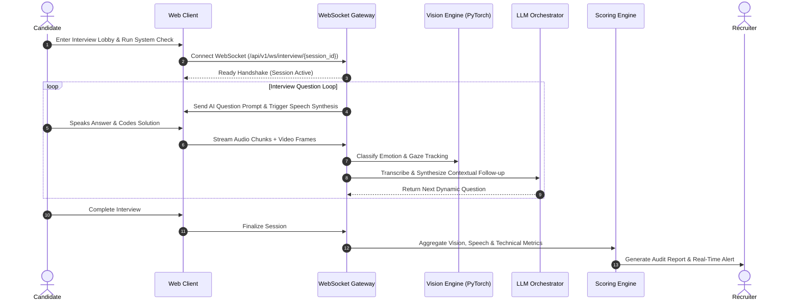

<div align="center">

# 🚀 SmartHire AI
### Next-Generation Autonomous AI Mock Interview & Candidate Assessment Platform

[](https://fastapi.tiangolo.com)
[](https://reactjs.org/)
[](https://pytorch.org/)
[](https://www.typescriptlang.org/)
[](https://vitejs.dev/)
[](https://www.docker.com/)
[](https://opensource.org/licenses/MIT)

<p align="center">
  <b>SmartHire AI</b> bridges the gap between hiring teams and candidates by delivering high-fidelity, real-time autonomous technical interviews, multi-modal behavioral computer vision, automated integrity verification, and instant evidence-based assessment reports.
</p>

[✨ Key Features](#-key-features) • [🏛 System Architecture](#-system-architecture) • [🚀 Quick Start](#-quick-start) • [🧠 AI & ML Engine](#-ai--behavioral-ml-engine) • [🖥 Portal Walkthroughs](#-portal-walkthroughs) • [📡 API Reference](#-api-reference) • [🐳 Docker Setup](#-docker-deployment) • [🤝 Contributing](#-contributing)

---

</div>

## 📌 Overview

**SmartHire** is an enterprise-grade, end-to-end recruitment intelligence platform designed to conduct dynamic, conversational technical and behavioral interviews. Powered by an ensemble of multi-provider LLMs (Gemini, Groq, OpenRouter) and custom-trained PyTorch computer vision models, SmartHire objectively evaluates candidates while drastically shortening the hiring cycle from weeks to minutes.

### 🌟 Why SmartHire?
- ⏱️ **Zero Waiting Time**: Real-time conversational interview loop with sub-second speech-to-text and streaming responses.
- 🎯 **Objective Evidence-Based Scoring**: Replaces subjective feedback with structured rubrics (Technical Depth, Problem Solving, Communication, Confidence).
- 🛡️ **Autonomous Proctoring & Integrity**: In-browser and server-side integrity engine tracking gaze diversion, multi-person presence, and window blurs.
- 🔄 **Fault-Tolerant AI Engine**: Automated multi-key rotation and multi-provider failover (Google Gemini ↔ Groq LLaMA 3.3 ↔ OpenRouter).
- 📄 **Executive PDF Generation**: Automated multi-page evaluation reports ready for engineering managers and talent partners.

---

## ✨ Key Features

### 🎙️ 1. Dynamic Live AI Interviewer
- **Adaptive Follow-Up Planner**: Evaluates candidates' spoken and coded responses on-the-fly and generates targeted contextual follow-up questions.
- **Bi-Directional Real-Time Interaction**: Real-time WebSockets handle streaming audio, text transcripts, and visual telemetry synchronously.
- **Multi-Track Sessions**: Dedicated tracks for Software Engineering, System Design, Data Structures & Algorithms, Frontend, Backend, and DevOps.

### 👁️ 2. Computer Vision & Behavioral Analysis
- **Custom PyTorch Behavioral CNN (`SmartHireBehaviorCNN`)**: Analyzes candidate expressions into 8 evidence-based behavioral states (*confident, focused, thinking, hesitant, neutral, confused, stressed, frustrated*).
- **Gaze & Focus Tracking**: Calculates eye gaze vectors and head-pose orientation to ensure natural conversational engagement.
- **Temporal EMA Smoothing**: Exponential Moving Average filtering eliminates frame-to-frame classification jitter.

### 🔊 3. Speech & Acoustic Intelligence
- **Vocal Metric Extraction**: Measures Words-Per-Minute (WPM) speaking velocity, filler-word frequency (*"um", "uh", "like"*), pause durations, and vocal confidence.
- **Accurate Audio Transcription**: Whisper-compatible multi-language acoustic processing pipeline.

### 🛡️ 4. Proctoring & Anti-Cheating Integrity Engine
- **Tab & Window Monitor**: Immediate detection and logging of tab-switching or developer-tools activation.
- **Multi-Person & Device Detection**: Object-detection models flag unauthorized individuals or external smartphones in the camera frame.
- **Chronological Incident Audit**: Every flag is timestamped and attached with screenshot evidence directly into the recruiter audit trail.

### 💼 5. Recruiter Intelligence Hub
- **Recruitment Pipeline Kanban**: Interactive workflow tracking candidates from *Applied* ➔ *Shortlisted* ➔ *Interviewed* ➔ *Evaluated* ➔ *Offered*.
- **Comprehensive Candidate Profiles**: Interactive resume parser, scoring radar charts, video recording playback, and synchronized question timelines.
- **One-Click Formal Offer Generation**: Automated offer letters with role specifics, compensation packages, and customizable onboarding timelines.

### 🎓 6. Candidate Practice & Upskilling Hub
- **Mock Interview Simulator**: Safe sandbox for candidates to rehearse behavioral and technical interviews with instant AI feedback.
- **Interactive Coding Environment**: Integrated Monaco code editor with multi-language execution syntax highlighting.
- **Curated Practice Recommendations**: AI pinpoints specific knowledge gaps (e.g., *Concurrency in Go*, *SQL Indexing*) with direct study links.

---

## 🏛 System Architecture

SmartHire utilizes a decoupled, event-driven microservices architecture built for high-concurrency real-time workloads:

```mermaid
graph TB
    subgraph Client Layer
        Candidate[Candidate Web App\nReact 18 + Vite + TS]
        Recruiter[Recruiter Command Center\nReact 18 + TailwindCSS]
    end

    subgraph Gateway & Realtime
        WS[WebSocket Hub\n/ws/interview]
        API[FastAPI REST Gateway\n/api/v1/*]
    end

    subgraph Intelligence Services
        AI_Orch[Multi-LLM Orchestrator\nGemini 2.0 | Groq LLaMA 3.3 | OpenRouter]
        Vision_Svc[Computer Vision Engine\nSmartHireBehaviorCNN + Gaze]
        Audio_Svc[Acoustic & Speech Service\nWhisper Pipeline + Audio Metrics]
        Scoring_Eng[Comprehensive Scoring Engine\nRubrics + Radar Analytics]
        Integrity_Eng[Anti-Cheating Integrity Engine\nTab, Multi-Face & Device Proctor]
    end

    subgraph Data & Storage Layer
        DB[(PostgreSQL / SQLite\nSQLAlchemy Async Engine)]
        Media[Local / Cloud Media Storage\nVideos & Transcripts]
        Reports[PDF Reporting Engine\nReportLab Synthesis]
    end

    Candidate -->|WebRTC / WS Audio & Video| WS
    Candidate -->|REST Requests| API
    Recruiter -->|Admin REST Requests| API

    WS --> Vision_Svc
    WS --> Audio_Svc
    WS --> Integrity_Eng

    API --> AI_Orch
    API --> Scoring_Eng
    API --> Reports

    Vision_Svc --> DB
    Audio_Svc --> DB
    Scoring_Eng --> DB
    Integrity_Eng --> DB
    Reports --> Media
```

### 🔄 Real-Time Interview Session Lifecycle



---

## 🛠 Tech Stack

| Domain | Technology | Description |
| :--- | :--- | :--- |
| **Frontend Framework** | React 18, TypeScript, Vite | Ultra-fast SPA with strict type safety |
| **Styling & UI** | TailwindCSS, Framer Motion, Lucide | Modern glassmorphism design with Dark/Light mode |
| **Code Editor** | Monaco Editor (`@monaco-editor/react`) | In-browser VS Code editing experience |
| **Charts & Radar** | Recharts | Interactive visual performance matrices |
| **Backend Framework** | FastAPI (Python 3.10+) | High-throughput asynchronous REST & WebSocket API |
| **Deep Learning** | PyTorch, Torchvision, PIL, NumPy | Custom behavioral 8-class facial expression CNN |
| **Proctoring AI** | TensorFlow.js, COCO-SSD | Client-side zero-latency object & multi-face verification |
| **AI / LLM Core** | Google Gemini 2.0, Groq LLaMA 3.3, OpenRouter | Multi-provider load-balanced intelligence pool |
| **Database & ORM** | PostgreSQL 18 / SQLite 3, SQLAlchemy Async | Dual-mode enterprise ORM with dynamic migrations |
| **Containerization** | Docker, Docker Compose, Nginx | Multi-container reproducible production stack |

---

## 🚀 Quick Start

### Prerequisites
- **Python 3.10+** (Python 3.11 or 3.12 recommended)
- **Node.js 18+** & `npm`
- **Git**

---

### 📥 1. Clone the Repository
```bash
git clone https://github.com/Satyamsin004/SmartHire.git
cd SmartHire
```

---

### ⚙️ 2. Environment Configuration
Create your `.env` file in the root directory from the template:
```bash
cp .env.example .env
```
Edit `.env` and add at least one AI API key (Gemini, Groq, or OpenRouter):
```env
# Instant zero-config local setup:
USE_SQLITE=true

# Add at least one of the following:
GEMINI_API_KEY_1=your_google_gemini_api_key
GROQ_API_KEY_1=your_groq_api_key
OPENROUTER_API_KEY_1=your_openrouter_api_key
```

---

### 🐍 3. Backend Setup

```bash
# Navigate to backend directory
cd backend

# Create and activate virtual environment
# Windows (PowerShell):
python -m venv venv
.\venv\Scripts\Activate.ps1

# Linux / macOS:
# python3 -m venv venv
# source venv/bin/activate

# Install dependencies
pip install -r requirements.txt

# (Optional) Seed sample job postings & test accounts
python seed_clean_jobs.py

# Start FastAPI development server
uvicorn app.main:app --host 0.0.0.0 --port 8000 --reload
```
> 📍 **Backend API**: `http://localhost:8000`  
> 📖 **Interactive Swagger UI**: `http://localhost:8000/docs`  
> 📑 **ReDoc Documentation**: `http://localhost:8000/redoc`

---

### 💻 4. Frontend Setup

Open a new terminal window:
```bash
# Navigate to frontend directory
cd frontend

# Install node dependencies
npm install

# Launch frontend in development mode
npm run dev
```
> 🌐 **Application UI**: `http://localhost:3001` (or `http://localhost:5173`)

---

## 🐳 Docker Deployment

Run the complete production-grade stack (PostgreSQL + Redis + pgAdmin + Backend + Frontend) in one command:

```bash
# Launch all microservices
docker-compose up --build -d

# Verify running services
docker-compose ps
```

| Service | Container Name | Port Mapping | Healthcheck |
| :--- | :--- | :--- | :--- |
| **FastAPI Backend** | `smarthire_backend` | `http://localhost:8000` | Automated |
| **Frontend Web** | `smarthire_frontend` | `http://localhost:3001` | Nginx Alpine |
| **PostgreSQL 18** | `smarthire_postgres` | `localhost:5432` | `pg_isready` |
| **Redis 7** | `smarthire_redis` | `localhost:6379` | `redis-cli ping` |
| **pgAdmin 4** | `smarthire_pgadmin` | `http://localhost:5050` | Web Interface |

---

## 🧠 AI & Behavioral ML Engine

SmartHire includes a custom PyTorch Convolutional Neural Network trained specifically for candidate behavioral recognition during remote assessments.

```
Input Frame (48x48 Grayscale)
      │
      ├──> Conv2D(32) + BatchNorm + ReLU ──> MaxPool2D(2x2) + Dropout(0.25)
      ├──> Conv2D(64) + BatchNorm + ReLU ──> MaxPool2D(2x2) + Dropout(0.25)
      ├──> Conv2D(128) + BatchNorm + ReLU ──> MaxPool2D(2x2) + Dropout(0.35)
      ├──> Conv2D(256) + BatchNorm + ReLU ──> AdaptiveAvgPool2D
      │
      └──> Flatten ──> Dense(512) + ReLU + Dropout(0.5) ──> Dense(8 Classes)
```

<details>
<summary><b>🔍 Expand: Behavioral Classes & Evidence Language Rubric</b></summary>

| Class | Evidence-Based Interpretation | Recruiter Insight |
| :--- | :--- | :--- |
| **Confident** | Open posture, steady eye contact, fluid vocal pacing | Candidate exhibits strong mastery and communication ease |
| **Focused** | Direct screen gaze, consistent attention, analytical posture | High technical engagement and active problem-solving |
| **Thinking** | Upward/lateral gaze fixation, deliberate paused cadence | Formulating algorithmic design or considering edge cases |
| **Hesitant** | Pauses exceeding 3 seconds, frequent filler vocalizations | May be seeking clarification or unsure of technical approach |
| **Confused** | Furrowed brow, repeated question scanning | Question phrasing may require clarification |
| **Neutral** | Baseline calm listening posture | Standard conversational state |
| **Stressed** | Rapid eye shifts, elevated speaking rate | High-pressure scenario; observation only |
| **Frustrated** | Negative vocal inflection, disengagement signals | Candidate encountering friction with compiler/problem |

</details>

<details>
<summary><b>📈 Expand: Model Validation & Training Reports</b></summary>

The pre-trained model weights are bundled at `backend/ml/emotion/models/checkpoints/best_behavior_model.pt`.
- **Validation Accuracy**: ~71.4% top-1 accuracy on 8-class facial expression evaluation benchmarks.
- **Dataset**: FER2013 augmented with balanced behavioral interview video frames.
- **Inference Latency**: `< 18ms` per frame on CPU (`< 3ms` on CUDA GPU).
- **Confusion Matrix & Metrics**: Available under `backend/ml/emotion/reports/`.

To retrain the model on your own dataset:
```bash
python backend/ml/emotion/download_dataset.py --dir data/
python backend/ml/emotion/train.py --epochs 40 --batch-size 64
python backend/ml/emotion/evaluate.py
```
</details>

---

## 🖥 Portal Walkthroughs

### 🧑‍💼 For Candidates
1. **Resume Ingestion & Profile Setup**: Upload PDF/DOCX resumes to instantly parse skills, experience, and educational background.
2. **Interview Lobby Checklist**: Run automated microphone, camera, speaker, and network latency diagnostics.
3. **Interactive Live Interview**:
   - Spoken natural dialogue with the AI interviewer.
   - Built-in Monaco code editor for real-time live coding challenges.
   - Immediate feedback upon session conclusion.
4. **Performance Breakdown**: View historical reports, question-by-question scoring, and customized study roadmaps.

### 👔 For Recruiters & Hiring Managers
1. **Pipeline Dashboard**: Monitor live interview stats, active applicant counts, and overall passing rates.
2. **Candidate Evaluation Modal**: Deep dive into aggregated scores:
   - Technical Competency Score (0-100)
   - Communication & Articulation Score (0-100)
   - Code Quality & Optimization Score (0-100)
   - Proctoring Integrity Audit Log (Tab-switches, gaze deviations)
3. **One-Click Executive PDF Export**: Download beautiful formatted reports ready for stakeholders.
4. **Job Posting & Scheduling Engine**: Create customized job descriptions with required interview tracks and automated email invitations.

---

## 📡 API Reference

Interactive OpenAPI documentation is hosted natively at `/docs`. Below are key endpoints:

<details>
<summary><b>🔐 Authentication & User Endpoints</b></summary>

- `POST /api/v1/auth/register` — Register candidate or recruiter account
- `POST /api/v1/auth/login` — OAuth2 password flow; returns JWT bearer token
- `GET /api/v1/auth/google/login` — Initiate Google OAuth 2.0 SSO
- `GET /api/v1/auth/google/callback` — Google OAuth 2.0 redirect callback
- `GET /api/v1/users/me` — Retrieve current authenticated user profile
</details>

<details>
<summary><b>🎙️ Interview & Assessment Endpoints</b></summary>

- `POST /api/v1/interview/create` — Initialize a new AI interview session
- `GET /api/v1/interview/{session_id}` — Fetch session metadata and state
- `WS /api/v1/ws/interview/{session_id}` — Bi-directional WebSocket stream for live interview audio/video/text
- `POST /api/v1/interview/{session_id}/complete` — Conclude interview and initiate scoring pipeline
- `GET /api/v1/interview/{session_id}/report` — Retrieve detailed evaluation report
- `GET /api/v1/interview/{session_id}/report/pdf` — Stream generated PDF assessment report
</details>

<details>
<summary><b>💼 Recruiter & Management Endpoints</b></summary>

- `GET /api/v1/recruiter/candidates` — List candidates with search, filter, and pagination
- `GET /api/v1/recruiter/pipeline` — Fetch hiring stage pipeline metrics
- `POST /api/v1/jobs` — Create new job requisition
- `POST /api/v1/scheduling/invite` — Send candidate interview invitation
- `POST /api/v1/offers/generate` — Generate official offer letter
</details>

---

## 🧪 Testing & Verification

SmartHire features comprehensive backend and frontend test suites:

```bash
# Run backend unit, integration, and E2E interview tests
cd backend
pytest tests/ app/tests/ -v

# Run live interview pipeline verification
python test_complete_interview_workflow.py

# Test frontend typecheck and build
cd ../frontend
npm run build
```

---

## 📁 Repository Structure

```
SmartHire/
├── backend/
│   ├── app/
│   │   ├── api/v1/               # REST & WebSocket API Routers
│   │   │   ├── auth.py           # JWT & OAuth 2.0
│   │   │   ├── interview.py      # Live Interview Lifecycle
│   │   │   ├── recruiter.py      # Candidate & Job Pipeline
│   │   │   ├── websocket.py      # Real-time WebSocket Protocol
│   │   │   └── ...
│   │   ├── core/                 # App Settings, Database & Event Bus
│   │   ├── dependencies/         # Auth & Session Dependencies
│   │   ├── models/domain.py      # 25+ SQLAlchemy Domain Entities
│   │   ├── services/             # Core Business & AI Logic
│   │   │   ├── ai_engine.py      # Multi-LLM Orchestrator
│   │   │   ├── ai_provider.py    # Gemini, Groq, OpenRouter Load Balancer
│   │   │   ├── emotion_service.py# Vision & Facial Behavior Service
│   │   │   ├── gaze_analyzer.py  # Eye Gaze Vector Computation
│   │   │   ├── integrity_service.py # Anti-Cheating Incident Auditor
│   │   │   ├── scoring_engine.py # Evaluation & Rubric Calculator
│   │   │   ├── pdf_service.py    # Executive PDF Generator
│   │   │   └── ...
│   │   └── main.py               # FastAPI Application Entrypoint
│   ├── ml/                       # Machine Learning Subsystem
│   │   └── emotion/              # PyTorch Behavior CNN
│   │       ├── model.py          # CNN Architecture
│   │       ├── train.py          # PyTorch Training Loop
│   │       ├── inference.py      # Real-time Inference Engine
│   │       └── models/checkpoints/ # Trained Model Checkpoints (.pt)
│   ├── requirements.txt          # Python Dependencies
│   └── seed_clean_jobs.py        # Seed Script for Demo Data
├── frontend/
│   ├── src/
│   │   ├── components/           # Reusable UI & Interview Components
│   │   ├── context/              # Auth, Theme & WebSocket Contexts
│   │   ├── pages/                # Candidate & Recruiter Views
│   │   │   ├── CandidateDashboard.tsx
│   │   │   ├── RecruiterDashboard.tsx
│   │   │   ├── interview/        # Live Interview Room & Lobby
│   │   │   └── practice/         # Candidate Practice Hub
│   │   ├── services/             # Axios API & Integrity Engine
│   │   └── App.tsx               # Main Application Routing
│   ├── package.json              # NPM Dependencies & Scripts
│   └── vite.config.ts            # Vite Configuration
├── docker-compose.yml            # Multi-Container Deployment Orchestration
├── .env.example                  # Environment Configuration Template
├── .gitignore                    # Git Exclusion Rules
└── README.md                     # Project Documentation
```

---

## 🔒 Security & Privacy

- **Data Privacy**: Candidate webcam frames are processed in-memory for real-time telemetry extraction and are not retained unless recruiter recording is explicitly enabled.
- **Evidence-Based Terminology**: The behavioral ML engine deliberately avoids pseudoscience or invasive claims; all metrics reflect factual observations (*e.g., eye gaze stability, response pacing, vocal hesitation*).
- **Environment Isolation**: Production secrets and database credentials remain strictly managed via environment variables.

---

## 🤝 Contributing

Contributions, issues, and feature requests are welcome!

1. Fork the Project
2. Create your Feature Branch (`git checkout -b feature/AmazingFeature`)
3. Commit your Changes (`git commit -m 'feat: Add some AmazingFeature'`)
4. Push to the Branch (`git push origin feature/AmazingFeature`)
5. Open a Pull Request

---

## 📄 License

Distributed under the **MIT License**. See `LICENSE` for more details.

---

<div align="center">
  <b>Built with ❤️ by <a href="https://github.com/Satyamsin004">Satyam Singh</a> and the SmartHire Team</b>
  <br>
  <sub>Empowering fair, unbiased, and intelligent hiring worldwide.</sub>
</div>
