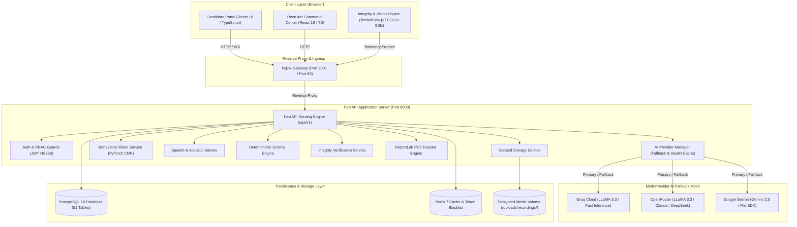
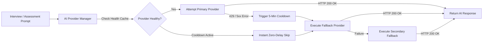
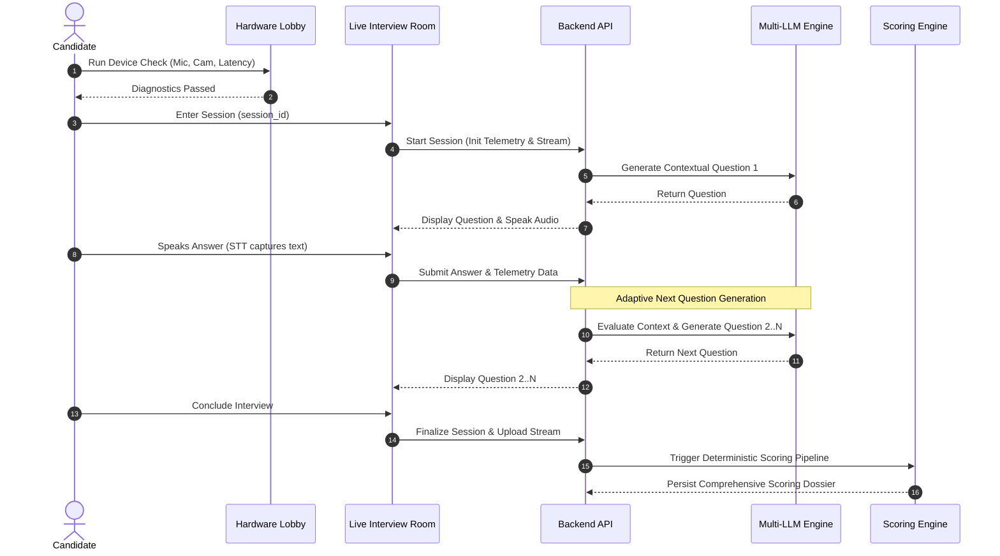

# SmartHire AI — Autonomous Interview & Candidate Assessment Platform

[](https://fastapi.tiangolo.com)
[](https://react.dev)
[](https://www.typescriptlang.org)
[](https://www.python.org)
[](https://www.postgresql.org)
[](https://redis.io)
[](https://pytorch.org)
[](https://www.docker.com)

SmartHire AI is an enterprise-grade autonomous AI-powered interview and candidate assessment platform designed to deliver real-time technical and behavioral assessments, automated proctoring verification, multi-dimensional deterministic scoring rubrics, and executive evaluation dossiers.

---

## Table of Contents

- [Overview](#overview)
- [System Architecture](#system-architecture)
- [Key Features](#key-features)
  - [Candidate Portal](#candidate-portal)
  - [Recruiter Command Center](#recruiter-command-center)
  - [Administrative Monitoring](#administrative-monitoring)
- [AI Capabilities & Fallback Architecture](#ai-capabilities--fallback-architecture)
- [Interview Workflows](#interview-workflows)
  - [Interactive AI Interview Workflow](#interactive-ai-interview-workflow)
  - [Technical Interview Workflow](#technical-interview-workflow)
  - [Behavioral & HR Interview Workflow](#behavioral--hr-interview-workflow)
- [Deep Evaluation & Telemetry Engines](#deep-evaluation--telemetry-engines)
  - [Speech & Acoustic Intelligence](#speech--acoustic-intelligence)
  - [Visual & Behavioral Analysis](#visual--behavioral-analysis)
  - [Proctoring & Integrity Enforcement](#proctoring--integrity-enforcement)
  - [Technical Evaluation Engine](#technical-evaluation-engine)
- [Deterministic Scoring System](#deterministic-scoring-system)
- [Executive Reports & Analytics](#executive-reports--analytics)
- [Security, RBAC & Recording Isolation](#security-rbac--recording-isolation)
- [Technology Stack](#technology-stack)
- [Project Structure](#project-structure)
- [Database Schema & Persistence](#database-schema--persistence)
- [API Reference](#api-reference)
- [Local Setup & Development](#local-setup--development)
  - [Prerequisites](#prerequisites)
  - [Environment Configuration](#environment-configuration)
  - [Backend Setup](#backend-setup)
  - [Frontend Setup](#frontend-setup)
  - [Docker Compose Deployment](#docker-compose-deployment)
- [Testing & Verification](#testing--verification)
- [Screenshots & Visuals](#screenshots--visuals)
- [Future Roadmap](#future-roadmap)
- [Disclaimer](#disclaimer)

---

## Overview

Traditional technical and behavioral interviews are bottlenecked by inconsistent interviewer calibration, scheduling friction, subjective scoring, and vulnerability to academic dishonesty. 

SmartHire AI solves this by orchestrating:
1. **Multi-LLM Intelligence**: Adaptive, context-aware question generation and answer scoring using a resilient fallback mesh (Groq, OpenRouter, Google Gemini).
2. **Real-Time Speech Processing**: Low-latency speech-to-text transcription paired with acoustic metrics (cadence, filler words, pause durations).
3. **Computer Vision & Telemetry**: PyTorch behavioral neural networks and eye-gaze tracking to measure attention, poise, and composure.
4. **Client-Side Proctoring**: Continuous integrity enforcement detecting tab switches, window blur events, developer tools, and unauthorized individuals.
5. **Deterministic Scoring**: Strict mathematical score calculation eliminating human bias and model hallucinations.
6. **Executive PDF Synthesis**: Instant generation of publication-ready, multi-page candidate evaluation dossiers for hiring managers.

---

## System Architecture

The following diagram illustrates the end-to-end architecture of SmartHire AI, spanning the client application, reverse proxy, FastAPI service layer, persistent stores, and external AI providers:



---

## Key Features

### Candidate Portal

| Feature | Description |
| :--- | :--- |
| **Authentication & Profile** | Secure JWT authentication with email/password and Google OAuth 2.0. Complete profile editing and career goals. |
| **Resume Parsing & ATS** | PDF and DOCX resume parsing extracting technical skills, work experience, education, and ATS formatting score. |
| **Job Discovery & Apply** | Browse active company job postings, review competency requirements and salary bands, and apply with a single click. |
| **Pre-Flight Hardware Check** | Automated lobby diagnostics checking camera stream, microphone clarity, speaker audio, and network round-trip latency. |
| **Interactive Live Interview** | Immersive full-screen interview room with synchronized STT transcription, live question display, and proctoring status. |
| **Practice Hub & Code Editor** | Targeted technical practice modules with an embedded Monaco Code Editor (`@monaco-editor/react`) for hands-on prep. |
| **Personal Analytics** | Interactive radar charts and historical score progression broken down by technical competency and communicative fluency. |
| **Real-Time Notifications** | In-app alerts for interview invites, application status transitions, and evaluation feedback. |

### Recruiter Command Center

| Feature | Description |
| :--- | :--- |
| **Executive Dashboard** | Live pipeline summary showing total applicants, active interviews, conversion rates, and recent assessment submissions. |
| **Requisition Management** | Full CRUD job management: define title, department, required tech stack, seniority, compensation, and custom questions. |
| **Candidate Pipeline** | Kanban-style pipeline tracking candidates through *Applied*, *Shortlisted*, *Interviewed*, *Evaluated*, and *Offered*. |
| **Side-by-Side Comparison** | Multi-candidate comparison matrix highlighting overall scores, technical depth, communication, and proctoring flags. |
| **Detailed Assessment Review** | Question-by-question playback, response transcripts, eye-gaze tracking graphs, and integrity infraction logs. |
| **PDF Dossier Export** | Generate branded, multi-page executive candidate evaluation dossiers formatted using ReportLab. |
| **Offer Letter Management** | Create, configure, and issue formal employment offers with start dates, compensation breakdowns, and downloadable letters. |

### Administrative Monitoring

* **Platform Health & Metrics**: Global user counts, active sessions, and database row counts across all domain entities.
* **Assessment Aggregation**: Pass/fail distributions, average score curves, and platform throughput statistics.
* **User & Role Governance**: Administrative oversight across candidate, recruiter, and administrator user accounts.

---

## AI Capabilities & Fallback Architecture

SmartHire AI utilizes a multi-tier AI routing gateway implemented in `app/services/ai_provider.py`. The system prevents vendor lock-in, eliminates single points of failure, and guarantees high availability during live interviews.

### Provider Mesh & Failover Strategy



* **Task-Specific Routing**:
  * **Interactive Interviews**: `Groq (LLaMA 3.3 Versatile)` &rarr; `OpenRouter (LLaMA 3.3 Instruct)` &rarr; `Google Gemini 2.5 Flash`. Optimized for sub-second conversational latency.
  * **Deep Assessments & Evaluations**: `OpenRouter` &rarr; `Groq` &rarr; `Google Gemini`. Optimized for comprehensive reasoning and multi-turn context.
* **Zero-Delay Failover**: When a provider hits a rate limit (HTTP 429), it is automatically placed in a 5-minute cooldown. Subsequent requests skip the cooldown provider instantly without network stalls.
* **API Key Pooling**: Supports multi-key pools (`GEMINI_API_KEY_1..4`, `OPENROUTER_API_KEY_1..2`, `GROQ_API_KEY_1..2`) with round-robin load distribution.

---

## Interview Workflows

### Interactive AI Interview Workflow



### Technical Interview Workflow
1. **Dynamic Questioning**: Questions adapt to the candidate's chosen technology stack (e.g., Python, React, Go, System Design) and claimed seniority.
2. **Follow-Up Inquiries**: The AI generates follow-up probes if an answer lacks depth, mentions a relevant trade-off, or overlooks edge cases.
3. **Coding Evaluation**: Candidates can write and review code snippets within the practice modules and technical assessment challenges.

### Behavioral & HR Interview Workflow
1. **STAR Methodology**: Questions evaluate *Situation, Task, Action, and Result* frameworks for leadership and conflict resolution.
2. **Acoustic & Pacing Metrics**: The platform monitors conversational fluency, measuring whether the candidate articulates thoughts clearly or demonstrates high hesitation.
3. **Sentiment & Composure**: Tracks facial expression consistency to measure confidence and professional decorum.

---

## Deep Evaluation & Telemetry Engines

### Speech & Acoustic Intelligence
Implemented in `backend/app/services/speech_analyzer.py`:
* **Speaking Pace (WPM)**: Analyzes words spoken per minute. Ideal conversational benchmark: 120–160 WPM. Flags extreme rushing (>210 WPM) or sluggishness (<80 WPM).
* **Pause Durations & Hesitation**: Identifies silent intervals and calculates pause-to-speech ratios.
* **Filler Word Tracking**: Detects occurrences of crutch words (*um*, *uh*, *like*, *you know*, *actually*, *basically*) and computes filler word density.

### Visual & Behavioral Analysis
Implemented in `backend/app/services/emotion_service.py` and `gaze_analyzer.py`:
* **Behavioral Neural Network**: Employs `SmartHireBehaviorCNN` (PyTorch checkpoint `smart-hire-behavior-v2.0`) to classify expressions into neutral, focused, confident, stressed, or distracted states.
* **Eye Gaze Vectoring**: Tracks horizontal and vertical gaze coordinates to verify screen engagement and note prolonged downward or side-glancing behavior.

### Proctoring & Integrity Enforcement
Implemented in `frontend/src/services/IntegrityEngine.ts` and `backend/app/services/integrity_service.py`:
* **Tab Switch & Window Blur**: Immediately detects and timestamps when candidates unfocus the interview window or switch browser tabs.
* **Multiple Person Detection**: In-browser computer vision (COCO-SSD) detects if additional individuals enter the camera frame.
* **Developer Tools Detection**: Detects console inspection, window resize anomalies, and shortcut triggers.
* **Deterministic Integrity Score**: Sessions begin with an integrity score of 100%. Each validated violation applies a weighted penalty, generating an immutable audit trail for recruiters.

### Technical Evaluation Engine
Implemented in `backend/app/services/technical_evaluator.py`:
* Evaluates keyword coverage against standard software engineering taxonomies.
* Measures conceptual depth, accuracy, architectural reasoning, and trade-off considerations.

---

## Deterministic Scoring System

SmartHire AI enforces a transparent, reproducible mathematical scoring engine (`app/services/scoring_engine.py`) based strictly on logged session evidence:

### Weighted Scoring Formula

$$\text{Overall Score} = (0.30 \times \text{Technical}) + (0.30 \times \text{Communication}) + (0.25 \times \text{Confidence}) + (0.15 \times \text{Professionalism})$$

| Metric | Weight | Contributing Signals |
| :--- | :---: | :--- |
| **Technical Depth** | **30%** | Answer correctness, architectural depth, keyword coverage, concept mastery. |
| **Communication** | **30%** | Speaking pace (WPM calibration), verbal clarity, low filler word density. |
| **Confidence** | **25%** | Gaze stability, composure, low hesitation, expression consistency. |
| **Professionalism** | **15%** | Punctuality, complete responses, adherence to proctoring guidelines. |

### Rating Categories & Recommendations

| Score Range | Performance Rating | Automated Recommendation |
| :---: | :--- | :--- |
| **90.0 – 100.0** | **Excellent** | **Shortlist (Priority)** |
| **75.0 – 89.9** | **Good** | **Shortlist** |
| **60.0 – 74.9** | **Average** | **Hold (Further Review)** |
| **40.0 – 59.9** | **Needs Improvement** | **Hold** |
| **0.0 – 39.9** | **Poor / Not Recommended** | **Reject** |

---

## Executive Reports & Analytics

Recruiters and hiring managers can download full candidate dossiers generated via ReportLab (`app/services/pdf_service.py`):

* **Multi-Page Executive PDF**:
  * Branded cover header with candidate metadata, role requisition, and session timestamp.
  * Executive Summary with overall score badge and recommendation banner.
  * 4-Dimension Metric Breakdown with visual progress bars.
  * Acoustic & Behavioral Analysis summary (WPM, gaze focus, filler count).
  * Proctoring Incident Audit Log (tab switches, gaze anomalies, person count violations).
  * Question-by-Question Transcript with individual question scores and feedback.

---

## Security, RBAC & Recording Isolation

* **Stateless JWT Cryptography**: HS256 algorithm with configurable access token expiry (`ACCESS_TOKEN_EXPIRE_MINUTES`) and refresh token cycling.
* **Role-Based Access Control (RBAC)**: Endpoint guards explicitly verify user roles (`candidate`, `recruiter`, `admin`).
* **IDOR Prevention & Ownership Verification**: Candidates can only access their own profile, sessions, applications, and reports. Cross-user access is rejected with HTTP 403 Forbidden.
* **Deterministic Recording Isolation**: Recordings are stored in strict, isolated paths:
  ```
  /uploads/recordings/{candidate_id}/{session_id}/{recording_id}.webm
  ```
  Directory traversal (`../`) is blocked by path sanitizers.
* **Authenticated Media Streaming**: Video and audio endpoints require valid Bearer token authorization and support HTTP 206 Partial Content range requests for seekable playback.
* **No Hardcoded Credentials**: Database passwords, secrets, and API keys are injected solely via environment variables.

---

## Technology Stack

| Layer | Technology | Purpose |
| :--- | :--- | :--- |
| **Frontend UI** | **React 18** (TypeScript) | Reactive user interface and dashboard components |
| **Frontend Tooling** | **Vite** | Fast Hot Module Replacement and production bundling |
| **Styling** | **TailwindCSS & CSS Tokens** | Modern, responsive enterprise styling |
| **Client Vision** | **TensorFlow.js & COCO-SSD** | In-browser proctoring and person detection |
| **Code Editor** | **Monaco Editor** | In-browser code editing in Practice Hub |
| **Charts** | **Recharts** | Radar charts, score bars, and analytics visualization |
| **Backend API** | **FastAPI** (Python 3.10+) | High-performance asynchronous REST and WebSocket API |
| **ORM** | **SQLAlchemy 2.0 (Async)** | Asynchronous database access and relationship mapping |
| **Relational DB** | **PostgreSQL 18** | Relational persistence for all application entities |
| **Cache & Broker** | **Redis 7** | Token invalidation blacklist and session caching |
| **Deep Learning** | **PyTorch & Torchvision** | Behavioral CNN models for emotion classification |
| **PDF Synthesis** | **ReportLab** | Enterprise PDF candidate evaluation dossier generation |
| **Containerization** | **Docker & Docker Compose** | Multi-service orchestration and production deployment |
| **Reverse Proxy** | **Nginx (Alpine)** | Static asset serving, TLS termination, API routing |

---

## Project Structure

```
SmartHire/
├── .env.example                          # Environment variable configuration template
├── .gitignore                            # Git exclusion rules (secrets, media, caches)
├── docker-compose.yml                    # Multi-container service definitions
├── README.md                             # Project documentation
├── backend/
│   ├── app/
│   │   ├── api/v1/                       # API endpoint routers
│   │   │   ├── admin.py                  # Administrative statistics & governance
│   │   │   ├── analytics.py              # Candidate & recruiter analytics
│   │   │   ├── aptitude.py               # Technical assessments & question banks
│   │   │   ├── auth.py                   # JWT login, registration & Google OAuth
│   │   │   ├── interview.py              # Live interview sessions & answers
│   │   │   ├── jobs.py                   # Job requisition management
│   │   │   ├── notifications.py          # User notification endpoints
│   │   │   ├── recruiter.py              # Recruiter pipelines & comparisons
│   │   │   ├── resume.py                 # Resume upload & ATS parsing
│   │   │   ├── scheduling.py             # Interview invitations & calendar slots
│   │   │   ├── uploads.py                # Media uploads & authenticated streaming
│   │   │   └── users.py                  # User profiles & settings
│   │   ├── core/                         # Config, database engine, security & migrations
│   │   ├── models/domain.py              # SQLAlchemy domain models (51 tables)
│   │   ├── schemas/domain.py             # Pydantic schemas for request/response validation
│   │   ├── services/                     # Business logic & AI pipelines
│   │   │   ├── ai_engine.py              # Prompt templates & LLM query handling
│   │   │   ├── ai_provider.py            # Multi-provider failover mesh & health cache
│   │   │   ├── emotion_service.py        # PyTorch behavioral emotion classification
│   │   │   ├── gaze_analyzer.py          # Eye gaze vector computation
│   │   │   ├── integrity_service.py      # Anti-cheating & proctoring auditor
│   │   │   ├── pdf_service.py            # ReportLab evaluation dossier engine
│   │   │   ├── scoring_engine.py         # Deterministic multi-metric scoring calculator
│   │   │   ├── speech_analyzer.py        # WPM, pause & filler word acoustic analysis
│   │   │   └── storage_service.py        # Isolated file & recording storage manager
│   │   └── main.py                       # FastAPI application entrypoint
│   ├── ml/                               # Behavioral CNN models & weights
│   ├── tests/                            # Automated pytest test suites (163 tests)
│   ├── Dockerfile                        # Backend container build instructions
│   ├── requirements.txt                  # Python dependencies
│   └── ensure_db_schema.py               # Schema integrity verification script
├── frontend/
│   ├── src/
│   │   ├── components/                   # Modals, layout, navigation & controls
│   │   ├── context/                      # Authentication & WebSocket state providers
│   │   ├── pages/                        # Candidate, Recruiter, and Admin pages
│   │   ├── services/                     # Axios API client & IntegrityEngine
│   │   ├── App.tsx                       # React application routing
│   │   └── index.css                     # Global styles & design tokens
│   ├── Dockerfile                        # Multi-stage production container build
│   ├── nginx.conf                        # Nginx reverse proxy configuration
│   ├── package.json                      # Node dependencies & build scripts
│   └── vite.config.ts                    # Vite build configuration
└── pgadmin/
    └── servers.json                      # Preconfigured pgAdmin PostgreSQL connection
```

---

## Database Schema & Persistence

SmartHire AI utilizes **PostgreSQL 18** with an asynchronous SQLAlchemy 2.0 ORM architecture comprising 51 domain entities:

<details>
<summary><strong>Click to view the 51 Database Tables</strong></summary>

| Category | Tables |
| :--- | :--- |
| **Authentication & Users** | `users`, `candidates`, `recruiters`, `admins`, `activity_logs` |
| **Job Requisitions & Applications** | `job_postings`, `job_descriptions`, `job_applications`, `saved_jobs`, `offer_letters` |
| **Resume & ATS Intelligence** | `resumes`, `resume_ats`, `resume_skills`, `resume_experiences`, `resume_educations`, `resume_projects`, `resume_certifications`, `resume_languages`, `resume_internships`, `resume_achievements`, `resume_views` |
| **Interview Sessions & Lifecycle** | `scheduled_interviews`, `interview_sessions`, `interview_templates`, `interview_questions`, `interview_answers`, `interview_transcripts`, `interview_transcript_segments` |
| **Multi-Modal Telemetry & Vision** | `interview_recordings`, `interview_speech_metrics`, `interview_visual_metrics`, `interview_visual_observations`, `interview_vision_analysis`, `interview_integrity_events`, `interview_filler_events`, `eye_tracking`, `emotion_analysis`, `speech_analysis` |
| **Evaluation & Reports** | `scoring_reports`, `achievements` |
| **Assessments & Question Banks** | `master_question_bank`, `assessment_questions`, `assessment_sessions`, `assessment_answers`, `assessment_results`, `assessment_question_history`, `candidate_question_history`, `recruiter_assessment_history` |
| **Notifications & System Logs** | `notifications`, `email_notification_logs`, `reminder_schedule_logs` |

</details>

* **Automatic Startup Synchronization**: The application executes `ensure_db_schema.py` and `app/core/migrations.py` on startup to verify all tables, foreign key constraints (90 foreign keys), and indexes (233 indexes) are intact.

---

## API Reference

The backend exposes a structured RESTful and WebSocket API under `/api/v1`:

| Router | Prefix | Description |
| :--- | :--- | :--- |
| **Auth** | `/api/v1/auth` | Login, registration, token refresh, Google OAuth 2.0 callback |
| **Users** | `/api/v1/users` | User profile retrieval, avatar uploads, password updates |
| **Jobs** | `/api/v1/jobs` | Job postings, search, filters, candidate applications |
| **Interview** | `/api/v1/interview` | Session lifecycle, question generation, answer submissions, scoring |
| **Recruiter** | `/api/v1/recruiter` | Candidate management, comparison matrix, report generation |
| **Scheduling** | `/api/v1/scheduling` | Interview slots, scheduling, candidate invitations |
| **Resume** | `/api/v1/resume` | Resume PDF/DOCX parsing, skill extraction, ATS scoring |
| **Uploads** | `/api/v1/uploads` | Authenticated media upload, range streaming (HTTP 206) |
| **Analytics** | `/api/v1/analytics` | Candidate skill radar, score progression, recruiter metrics |
| **Aptitude** | `/api/v1/aptitude` | Question bank queries, assessment challenges |
| **Admin** | `/api/v1/admin` | Platform statistics, health metrics, user governance |
| **Notifications**| `/api/v1/notifications`| User alerts, read status, notification preferences |

*Interactive OpenAPI / Swagger documentation is available at `http://localhost:8000/docs` when running.*

---

## Local Setup & Development

### Prerequisites
* **Docker & Docker Compose** (Recommended for full environment)
* **Python 3.10+** (For local backend development)
* **Node.js 18+ & npm** (For local frontend development)
* **PostgreSQL 18** and **Redis 7** (If running without Docker)

### Environment Configuration
Create your `.env` configuration from the provided template:

```bash
cp .env.example .env
```

Edit `.env` to configure your database password, secret key, and at least one AI provider API key (`GROQ_API_KEY_1`, `OPENROUTER_API_KEY_1`, or `GEMINI_API_KEY_1`).

### Docker Compose Deployment (Recommended)

Run the entire SmartHire AI stack (Frontend, Backend, PostgreSQL, Redis, pgAdmin) with a single command:

```bash
# Build and start all services in detached mode
docker compose up --build -d

# Verify all services are healthy
docker compose ps
```

Access services locally:
* **Frontend Application**: [http://localhost:3001](http://localhost:3001)
* **Backend API & Swagger Docs**: [http://localhost:8000/docs](http://localhost:8000/docs)
* **pgAdmin 4 Dashboard**: [http://localhost:5050](http://localhost:5050) (User: `admin@smarthire.ai`, Password: `pgadminpassword2026`)

### Manual Local Development

#### Backend Setup
```bash
cd backend

# Create and activate Python virtual environment
python -m venv venv

# Windows (PowerShell):
.\venv\Scripts\Activate.ps1
# Linux / macOS:
source venv/bin/activate

# Install dependencies
pip install -r requirements.txt

# Start FastAPI development server with auto-reload
uvicorn app.main:app --host 0.0.0.0 --port 8000 --reload
```

#### Frontend Setup
```bash
cd frontend

# Install dependencies
npm install

# Start Vite development server
npm run dev
```
The frontend will be accessible at `http://localhost:5173` (or the port specified in terminal).

---

## Testing & Verification

SmartHire AI includes comprehensive automated test suites covering API contracts, RBAC isolation, deterministic scoring, and PDF generation:

```bash
cd backend

# Run the complete test suite
pytest -v

# Run targeted test suites
pytest tests/test_api.py -v
pytest tests/test_rbac_and_idor.py -v
pytest tests/test_scoring_and_resume_stress.py -v
pytest tests/test_pdf_stress.py -v

# Run frontend production build verification
cd ../frontend
npm run build
```

---

## Screenshots & Visuals

> *Screenshots demonstrating the Candidate Dashboard, Live Interview Room with real-time proctoring telemetry, Recruiter Comparison Matrix, and sample multi-page PDF evaluation dossiers:*

| Screen | Description |
| :---: | :--- |
|  | **Platform Welcome Visual** — 3D interactive welcome banner. |
| *Candidate Live Interview Room* | *Synchronized audio/video capture, live STT transcription, and real-time gaze telemetry.* |
| *Recruiter Evaluation Report* | *Multi-dimensional score breakdown, radar charts, and downloadable PDF dossier.* |
| *Candidate Comparison Matrix* | *Side-by-side metric comparison across applicants for open requisitions.* |

---

## Future Roadmap

- [ ] **Multi-Language Audio Transcription**: Extend STT to support non-English multilingual technical interviews.
- [ ] **Sandboxed Code Execution**: Real-time code execution containers (WebAssembly or isolated Docker) supporting Python, JavaScript, Go, and Java.
- [ ] **Calendar Bidirectional Sync**: Google Calendar and Microsoft Outlook integration for automated recruiter scheduling.
- [ ] **Custom Scoring Rubric Builder**: Organization-configurable scoring weights and competency definitions per job tier.

---

## Disclaimer

SmartHire AI is an autonomous interview and candidate assessment project developed for technical evaluation and demonstration. Analysis metrics, audio transcription accuracy, and AI responses are subject to third-party model availability, browser hardware permissions (camera/microphone), and configured API quotas.
