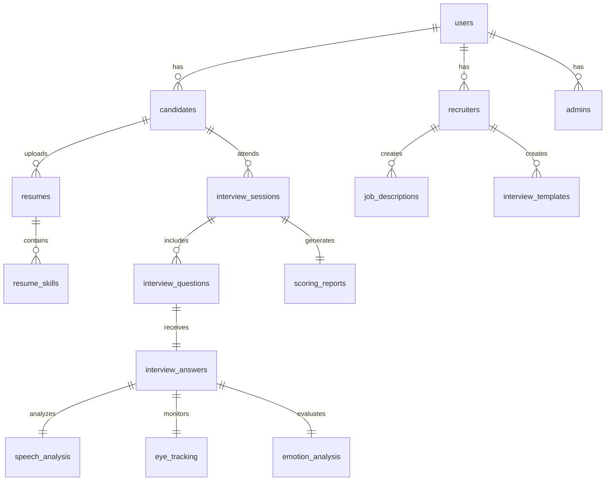

# PostgreSQL Database Schema & ERD Documentation

## Database Schema Diagram

## Entity Details

- **users**: Primary user account table with role ENUM (`candidate`, `recruiter`, `admin`).
- **candidates**: Stores readiness score, streak days, total interviews, target role.
- **resumes**: Stores ATS score, summary, keyword density JSON, missing skills.
- **interview_sessions**: Represents a full mock interview instance.
- **interview_questions**: Questions generated dynamically by AI engine.
- **interview_answers**: Transcripts, audio references, coding submissions.
- **speech_analysis**: WPM, filler word count, filler word list, grammar score.
- **eye_tracking**: Eye contact percentage, blink rate, attention score.
- **emotion_analysis**: Dominant emotion, confidence percentage, stress level.
- **scoring_reports**: 30-25-30-15 weighted score breakdown and improvement plan.
